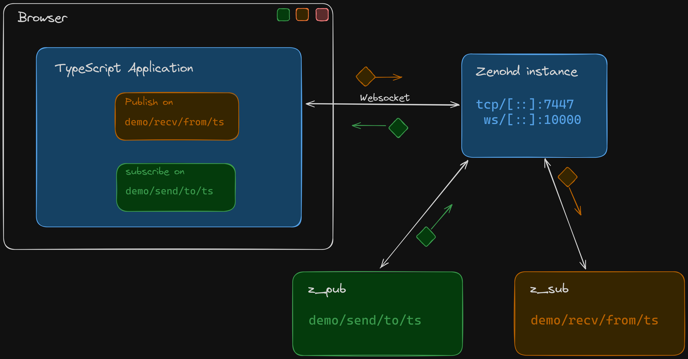

> :warning: **This is a WIP Active development project**: Experiment with with it, but it is **Not** production Ready!

[](https://discord.gg/2GJ958VuHs)
[](https://opensource.org/licenses/Apache-2.0)

# Eclipse Zenoh Typescript / Javascript API

The Eclipse Zenoh: Zero Overhead Pub/sub, Store/Query and Compute.

Zenoh (pronounce _/zeno/_) unifies data in motion, data at rest and computations. It carefully blends traditional pub/sub with geo-distributed storages, queries and computations, while retaining a level of time and space efficiency that is well beyond any of the mainstream stacks.

Check the website [zenoh.io](http://zenoh.io) and the [roadmap](https://github.com/eclipse-zenoh/roadmap) for more detailed information.

---

# Typescript/Javascript API

This repository provides a Typscript / Javascript binding based [zenoh-pico], a pico variant of zenoh written in C aimed at resource constrained systems (i.e. Micro controllers).  
The long term plan is to use zenoh [Zenoh written in Rust](https://github.com/eclipse-zenoh/zenoh) to target WASM.  
In its current state, it is not possible to compile Zenoh (Rust) to target WASM, and will need to undergo a fair amount of refactoring before that can happen.

---

## How to build it

> :warning: **WARNING** :warning: : Zenoh and its ecosystem are under active development. When you build from git, make sure you also build from git any other Zenoh repository you plan to use (e.g. binding, plugin, backend, etc.). It may happen that some changes in git are not compatible with the most recent packaged Zenoh release (e.g. deb, docker, pip). We put particular effort in maintaining compatibility between the various git repositories in the Zenoh project.

1. Make sure that the following utilities are available on your platform.

- [Docker](https://www.docker.com/), Please check [here](https://docs.docker.com/engine/install/) to learn how to install it.
- [NPM](https://www.npmjs.com/package/npm)
- Typescript

2. Clone the [source] with `git`:

   ```bash
   git clone --recurse-submodules git@github.com:ZettaScaleLabs/zenoh-ts.git
   ```

   This also clones [zenoh-pico] according to the `.gitmodules` file.

3. Build:

   While in active development, running the command

```bash
  cd ./zenoh-ts
```

then

```bash
  npm run build
```

Will run the build pipeline of

- Starting a Docker container containing the [Emscripten-SDK](https://emscripten.org/)
- Building [zenoh-pico] to target WASM, using CMake + the Emscripten toolchain
- Copying the artifacts from the build container to the host system
- The artifacts include:
  - `zenoh-wasm.js`
  - `zenoh-wasm.wasm`
  - `zenoh-wasm.worker.js`
- The compiling the typescript interface to Javascript, and exporting a types declaration file.
- Webpack to package

[source]: https://github.com/ZettaScale-Labs/zenoh-ts.git
[zenoh-pico]: https://github.com/eclipse-zenoh/zenoh-pico

## Running the Examples

Our Example structure, will have a pub/sub pair in the browser periodically putting,
and a pub/sub pair locally on the command line to match,

In order to run the examples, the user must:

1. From the `./examples/web/` directory, start an instance of the web application.

```bash
npm install && npm run develop
```

2. Start an instance of `zenohd` with the websocket transport enabled.
   This can be done by building the zenoh daemon `zenohd` from the Rust repo for [zenoh], and running the following command.

```
RUST_LOG=DEBUG ./zenohd -l tcp/[::]:7447 -l ws/[::]:10000
```

<!--
RUST_LOG=DEBUG cargo run zenohd -- -l tcp/[::]:7447 -l ws/[::]:10000
-->

3.1. For publishing from a Typescript application to Zenoh you can run the `z_sub` example from [zenoh] and start a subscriber locally as follows:

```
RUST_LOG=DEBUG ./z_sub -k demo/recv/from/ts
```

3.2. For subscribing in a Typescript application on a Key Expression on Zenoh you can run the `z_pub` example from [zenoh] and start a subscriber locally as follows:

```
RUST_LOG=DEBUG ./z_pub -k demo/send/to/ts
```

The setup should look like this diagram below



[zenoh]: https://github.com/eclipse-zenoh/zenoh

### Known Limitations + Future

This set of bindings to Typescript started out as a long running experiment to get a full implementation of the Zenoh protocol to compile and run natively in the browser.
It was born out of the then state of the Rust [Zenoh] implementation not supporting targeting Web Assembly due to project and library structure.  
At the time [Zenoh-pico] was ready to compile to WASM, and so this repository was born.  
After much experimentation, we have discovered a number of long term drawbacks of Zenoh-pico -> WASM using the Emscripten compiler and have decided to move in a different direction.
Between the many iterations of reducing interface, callback, async-compatability, and build complexity, to the limitations of Emscripten, we have found there are ways of getting Zenoh available to Typescript/Javascript developers with much lower development friction, both short term and long.

What works today is `put`, `publisher` and _mostly_ `subscriber`,
There is a recurring pthread issue when creating a `subscriber` that occurs when using this implementation (Async threaded TS <-> CPP interop != simple)

We are open sourcing this Repo for the community to see what was implemented, play around with what works, and as an option to fix what does not, but ultimately offer no production ready gaurentees with this set of language bindings in its current state.

We are switching focus to another, simpler and lower maintenence way of exposing Zenoh to a Typescript environment.  
Look out in our blog for announcements as we continue to strive to produce quality, roboust, performant software.
